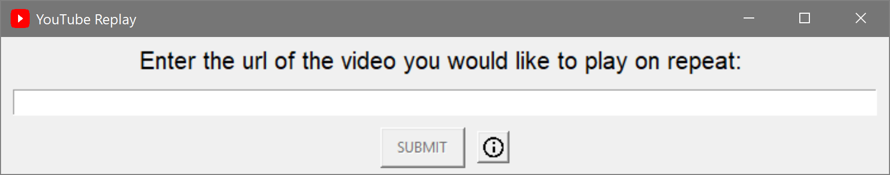
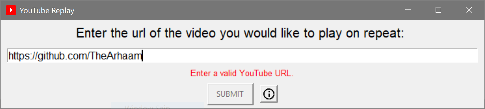
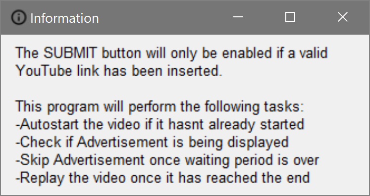

# Python-YouTube-Replay
Python program to automatically replay YouTube videos

  
  

Program will perform the following tasks:
   -Autostart the video if it hasn't already started
   -Check if Advertisement is being displayed
   -Skip Advertisement once waiting period is over
   -Replay the video once it has reached the end
 

  <b>SCREENSHOTS:</b>
   
   
   If you enter any text which is not a YouTube link:
   
   
   Clicking on the (i) information button will open the following popup:
   
   
   <b>DEMO GIF:</b>
   (You will notice that whenever I forward the video to the end, it restarts)
   

